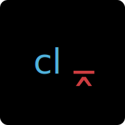

# Blog

<!-- TODO: ここにバッジ一覧 -->

<!-- TODO: netlify 更新 -->

[](https://app.netlify.com/sites/nostalgic-gates-9846f4/deploys)

<!-- textlint-disable ja-technical-writing/sentence-length -->

[](./LICENSE.md)
[](https://github.com/kuro-kuroite/test-kuroite/releases)
[](https://github.com/kuro-kuroite/test-kuroite/actions)
[](https://codecov.io/gh/kuro-kuroite/test-kuroite)
[](https://david-dm.org/kuro-kuroite/test-kuroite)
[](https://david-dm.org/kuro-kuroite/test-kuroite)
[](https://github.com/kuro-kuroite/test-kuroite/search?l=typescript)
[](https://renovatebot.com/)
[](https://github.com/semantic-release/semantic-release)

<!-- textlint-enable -->

[](https://storybook.js.org/)
[](https://github.com/facebook/jest)
[](https://www.cypress.io/)

[](https://conventionalcommits.org)
[](http://commitizen.github.io/cz-cli/)
[](https://github.com/prettier/prettier)

# 概要

モダンな Web フロントエンドの技術を中心に発信する技術ブログ。

<!-- TODO: LightHouse or Demo -->

<!-- TODO: blog link -->

[https://blog.kuroite.io](https://nostalgic-gates-9846f4.netlify.app)

## 環境

<!-- TODO: システム構成図 -->

## 機能一覧

以下の技術を使い、このブログを構成している。

- 静的サイトジェネレーター for Jamstack (Gatsby.js)
- モバイルファースト
- ダークモード対応
- 目次リンク
- Twitter、Hatena Bookmark 共有リンク
- プログレスバー
- 「ラベルの翻訳 [^1]」の英語対応
- コンポーネントのアクセシビリティテスト
- RSS 対応
- PWA 対応
- ページ
  - 記事ページ
  - 記事一覧ページ
  - タグ記事一覧ページ
  - 自己紹介ページ

### ブログ構成に必要な機能

- プライバシーポリシー
- robots.txt
- canonical
- meta tag

#### aside: 注意点

本ブログは、Internet Explorer に「**非**」対応である。
これは、開発元の Microsoft が今後機能追加をせずサポートを打ち切るため（[Microsoft 365 アプリの IE 11 サポート終了](support-ie11-url)）。
そして、サイズを小さくしブログの読み込み時間を短くするためである。

[support-ie11-url]: https://techcommunity.microsoft.com/t5/microsoft-365-blog/microsoft-365-apps-say-farewell-to-internet-explorer-11-and/ba-p/1591666

## 技術一覧

<!-- TODO: icon一覧 (/w url) -->

[](https://www.typescriptlang.org/ 'TypeScript: Typed JavaScript at Any Scale.')
[](https://reactjs.org/ 'React – A JavaScript library for building user interfaces')
[](https://eslint.org/ 'ESLint - Pluggable JavaScript linter')
[](https://prettier.io/ 'Prettier · Opinionated Code Formatter')
[](https://redux-toolkit.js.org/ 'Redux Toolkit | Redux Toolkit')
[](https://jestjs.io/ 'Jest · 🃠Delightful JavaScript Testing')
[](https://storybook.js.org/ 'Storybook: UI component explorer for frontend developers')
[](https://www.cypress.io/ 'JavaScript End to End Testing Framework | cypress.io')
[](https://www.gatsbyjs.com/ 'Gatsby')
[](https://postcss.org/ 'PostCSS - a tool for transforming CSS with JavaScript')
[](https://autoprefixer.github.io/ 'Autoprefixer CSS online')
[](https://stylelint.io/ 'stylelint.io')
[](https://tailwindcss.com/ 'Tailwind CSS - A Utility-First CSS Framework for Rapidly Building Custom Designs')
[](https://github.com/css-modules/css-modules/blob/master/README.md 'css-modules/README.md at master · css-modules/css-modules')
[](https://commitlint.js.org/#/ 'commitlint - Lint commit messages')
[](https://textlint.github.io/ 'textlint · The pluggable linting tool for text and markdown')

[](https://github.com/features/actions 'Features • GitHub Actions')
[](https://www.docker.com/ 'Empowering App Development for Developers | Docker')
[](https://docs.renovatebot.com/ 'Renovate Docs | Renovate Docs')
[](https://semantic-release.gitbook.io/semantic-release/ 'Introduction - semantic-release')
[](https://www.netlify.com/ 'Netlify: All-in-one platform for automating modern web projects')

詳細は、[技術選定.md](docs/技術選定.md '技術選定.md') で紹介。

# 開発者向け

## 事前要件

## インストール

### `develop`

```zsh
# TODO: clone
# docker
# yarn or npm install
# npx develop
```

### `deploy`

```zsh
# TODO: add
# commit /w lint(eslint, stylelint, textlint, and commitlint)
# push
```

### License

[](./LICENSE.md)

### 脚注

[^1]: [Kaizen Ad における SPA での i18n への取り組みと手法について - Kaizen Platform 開発者ブログ](https://developer.kaizenplatform.com/entry/axross/2018-07-02 'Kaizen AdにおけるSPAでのi18nへの取り組みと手法について - Kaizen Platform 開発者ブログ')
